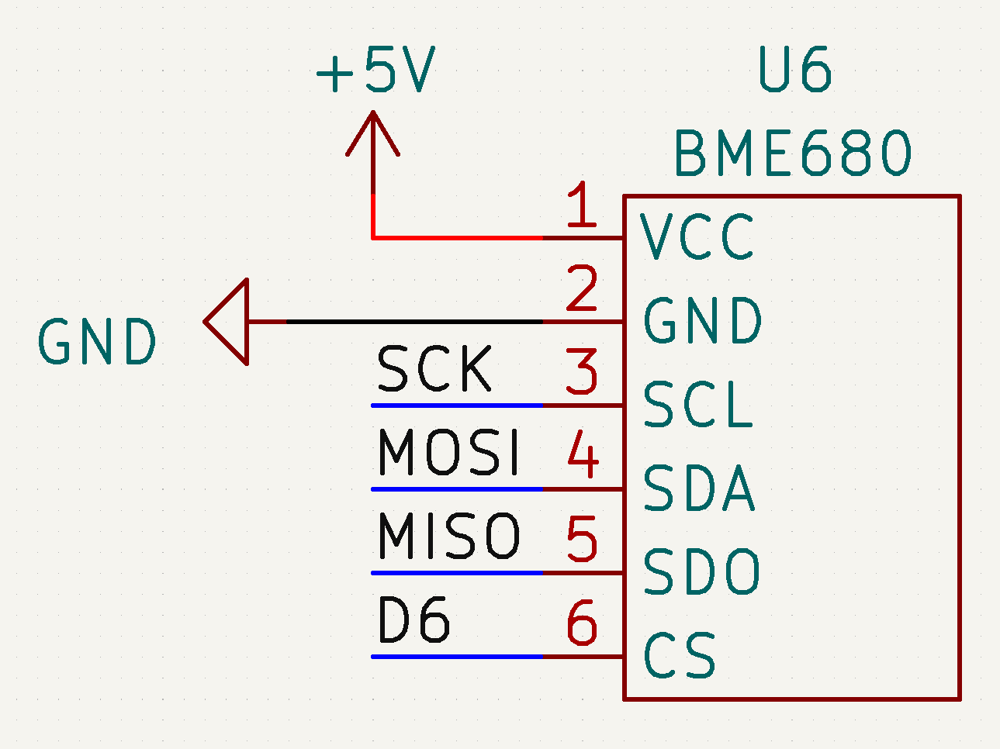

# Sources

- [randomnerdtutorials.com](https://randomnerdtutorials.com/bme680-sensor-arduino-gas-temperature-humidity-pressure/)

# Prerequisites

You first have to install the **Adafruit BME680** library in the arduino IDE library manager

# Schematic

## SPI

| Pin  | Uno | Mega |
| ---- | --- | ---- |
| MISO | 11  | 50   |
| MOSI | 12  | 51   |
| SCK  | 13  | 52   |

