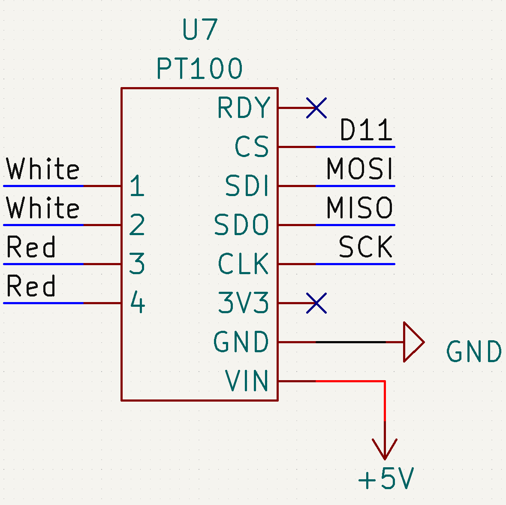

# Sources

- [learn.adafruit.com](https://learn.adafruit.com/adafruit-max31865-rtd-pt100-amplifier/)

# Prerequisites

You first have to install the **Adafruit MAX31865** in the arduino IDE library manager

# Schematic

## SPI

| Pin  | Uno | Mega |
| ---- | --- | ---- |
| MISO | 11  | 50   |
| MOSI | 12  | 51   |
| SCK  | 13  | 52   |

