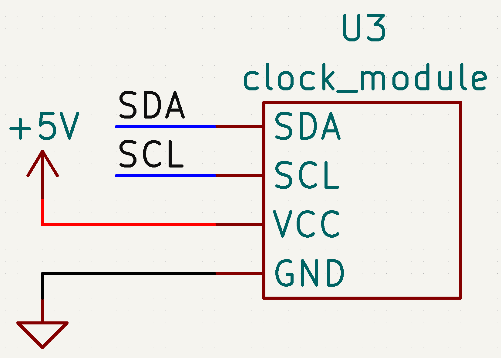

# Sources

- [wiki.dfrobot.com](https://wiki.dfrobot.com/Gravity__I2C_SD2405_RTC_Module_SKU__DFR0469)

# Prerequisites

You first have to install the [SD2405](https://github.com/DFRobot/Gravity-I2C-SD2405-RTC-Module/blob/master/GravityRtc.zip) library in the arduino IDE as a zip file

# Schematic

## I2C

| Pin | Uno | Mega |
| --- | --- | ---- |
| SDA | SDA | 20   |
| SCL | SCL | 21   |

