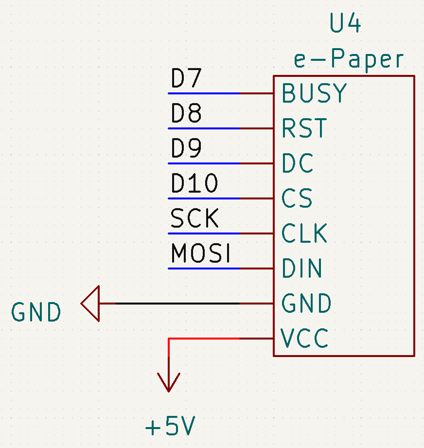

# Sources

- [waveshare.com](https://www.waveshare.com/wiki/5.83inch_e-Paper_HAT_(B)_Manual#Working_With_Arduino)

- [GxEPD2](https://github.com/ZinggJM/GxEPD2) github repo

# Prerequisites

You first have to install the **GxEPD2** library in the arduino IDE library manager

# Schematic

## SPI

| Pin  | Uno | Mega |
| ---- | --- | ---- |
| MOSI | 12  | 51   |
| SCK  | 13  | 52   |

## e-Paper layout

