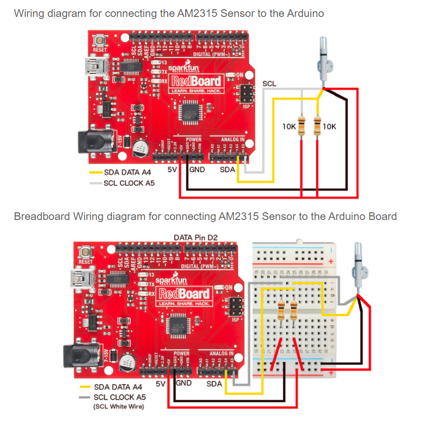

# Sources

- [cactus.io](http://cactus.io/hookups/sensors/temperature-humidity/am2315/hookup-arduino-to-am2315-temp-humidity-sensor)

- [learn.adafruit.com](https://learn.adafruit.com/am2315-encased-i2c-temperature-humidity-sensor/arduino-code)

# Prerequisites

You first have to install the **Adafruit AM2315** in the arduino IDE library manager

# Schematic

TODO KiCad

## I2C

| Pin | Uno | Mega |
| --- | --- | ---- |
| SDA | SDA | 20   |
| SCL | SCL | 21   |

