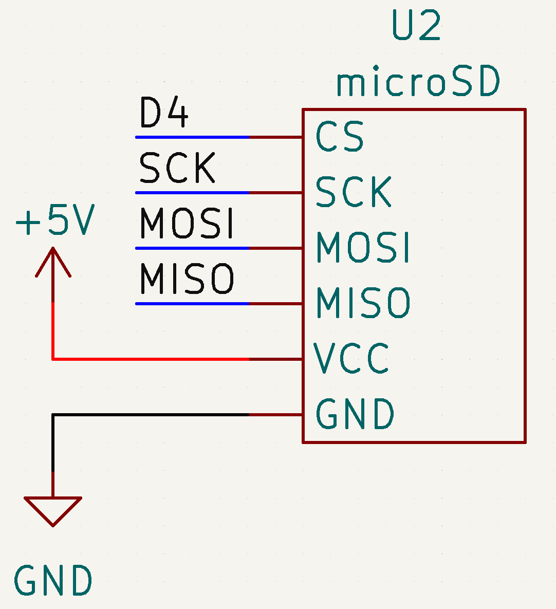

# TODO

- [x] create file name based on current time

# Sources

- [lastminuteengineers.com](https://lastminuteengineers.com/arduino-micro-sd-card-module-tutorial/)

# Schematic

## SPI

| Pin  | Uno | Mega |
| ---- | --- | ---- |
| MISO | 11  | 50   |
| MOSI | 12  | 51   |
| SCK  | 13  | 52   |

