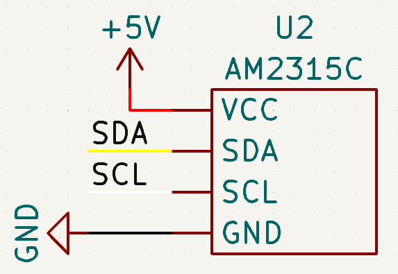

# Sources

- [learn.adafruit.com](https://learn.adafruit.com/adafruit-aht20)

# Dependencies

- [Adafruit AHTX0](https://github.com/adafruit/Adafruit_AHTX0)

# Schematic

## I2C

| Pin | Uno | Mega |
| --- | --- | ---- |
| SDA | SDA | 20   |
| SCL | SCL | 21   |
