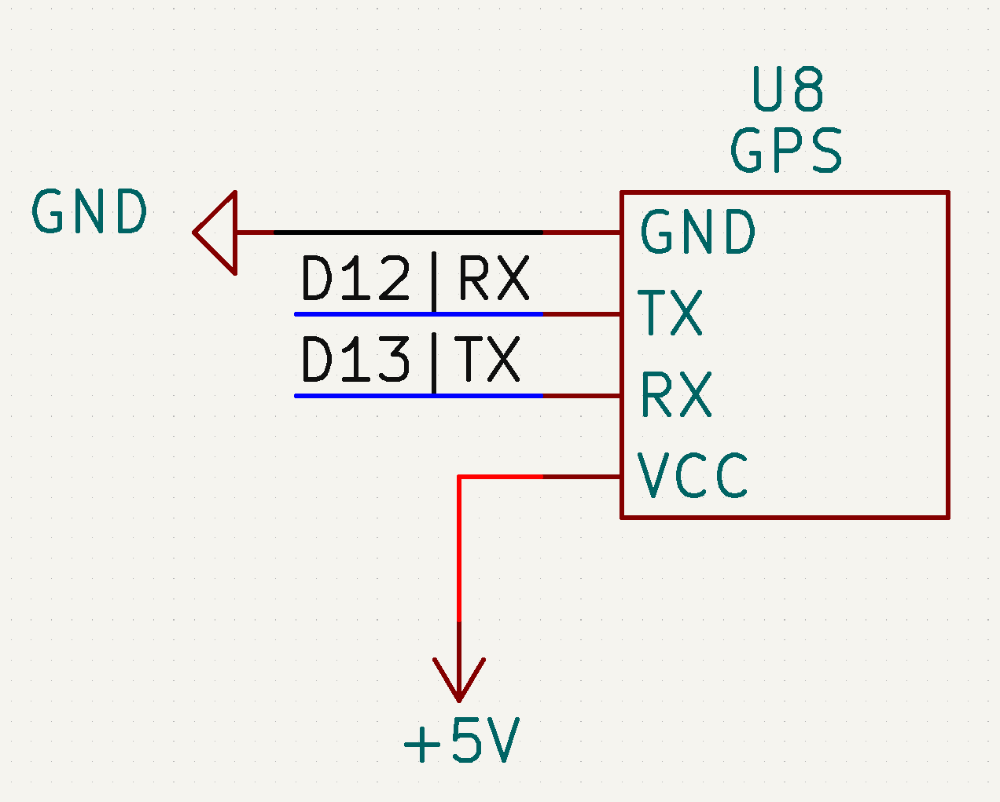

# Sources

- [arduinogetstarted.com](https://arduinogetstarted.com/tutorials/arduino-gps)

# TODO

Make sure the output is formatted according to the [ISO 6709](https://en.wikipedia.org/wiki/ISO_6709) standard.

# Prerequisites

You first have to install the **TinyGPSPlus** library in the arduino IDE library manager

# Schematic

