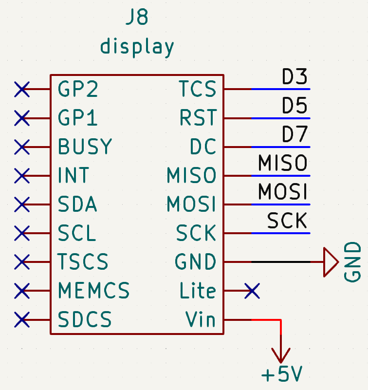

# Sources

- [learn.adafruit.com](https://learn.adafruit.com/2-2-tft-display)

# Dependencies

- [Adafruit ILI9341](https://github.com/adafruit/Adafruit_ILI9341)

# Schematic

## SPI

| Pin  | Uno | Mega |
| ---- | --- | ---- |
| MISO | 11  | 50   |
| MOSI | 12  | 51   |
| SCK  | 13  | 52   |
