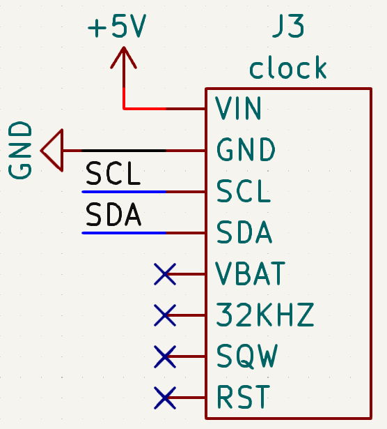

# Sources

- [learn.adafruit.com](https://learn.adafruit.com/adafruit-ds3231-precision-rtc-breakout)

# Dependencies

- [RTClib](https://github.com/adafruit/RTClib)

# Schematic

## I2C

| Pin | Uno | Mega |
| --- | --- | ---- |
| SDA | SDA | 20   |
| SCL | SCL | 21   |
