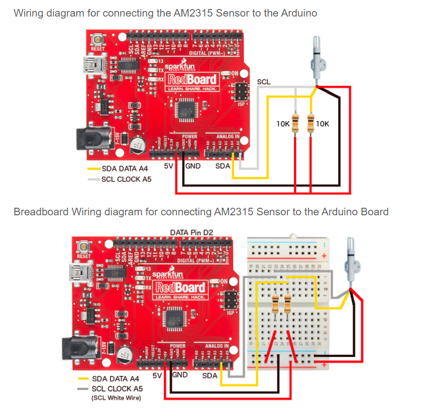

# Sources

[cactus.io](http://cactus.io/hookups/sensors/temperature-humidity/am2315/hookup-arduino-to-am2315-temp-humidity-sensor)

[learn.adafruit.com](https://learn.adafruit.com/am2315-encased-i2c-temperature-humidity-sensor/arduino-code)

# prerequisites

You first have to install the Adafruit_AM2315 library in the arduino IDE

# Schematic

